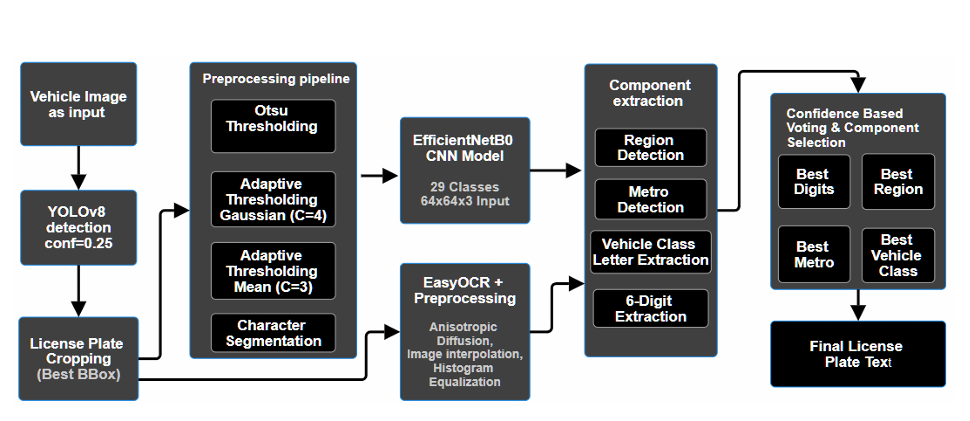
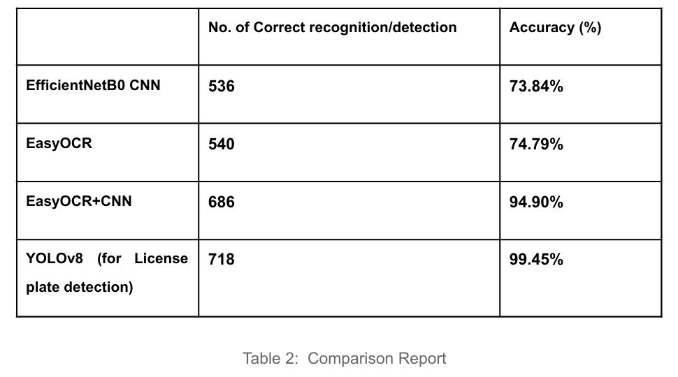
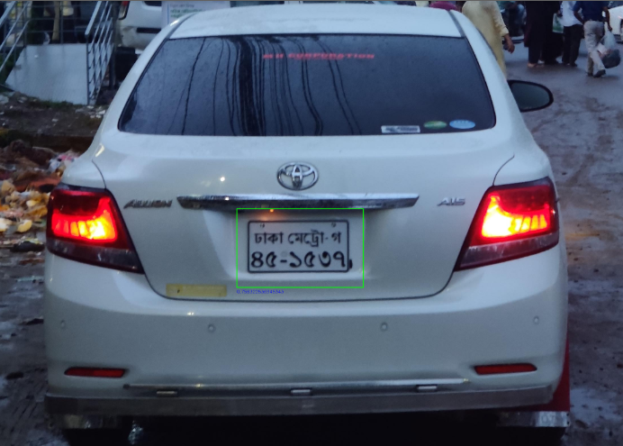
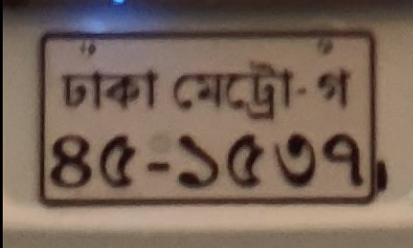
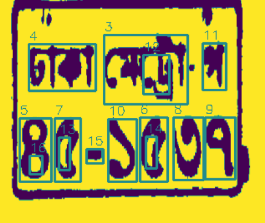
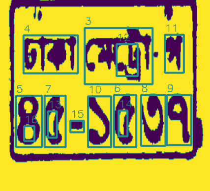
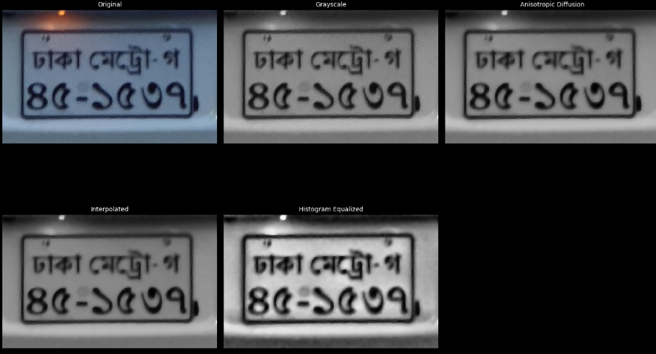
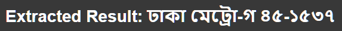

# Bangladeshi License Plate Detection & Recognition 🚘

**Automatic License Plate Recognition (ALPR) system** tailored for Bangladeshi vehicles.  
It combines **YOLOv8** for plate detection with a hybrid recognition pipeline using **EfficientNetB0** and **EasyOCR**, supported by preprocessing and confidence-based voting mechanisms.

---

## 📖 Overview

License plate recognition is a crucial component in **traffic management, automated toll collection, parking systems, and vehicle surveillance**.  
Unlike English or numeric plates, Bangla license plates present unique challenges due to:

-  Complex **Bangla script morphology** (consonants, vowels, compound characters).
-  **Inconsistent fonts** and plate designs.
-  **Lighting variations, noise, and occlusion** in real-world scenarios.

This project addresses these challenges through a robust, deep-learning-based pipeline.

---

## 🏗️ System Architecture

1. **Input Image** → Raw vehicle image.
2. **Detection Module** → YOLOv8 detects the license plate region.
3. **Plate Extraction** → Cropped region passed to preprocessing.
4. **Preprocessing Pipelines** → Thresholding (Otsu, Adaptive Gaussian, Adaptive Mean).
5. **Dual Recognition** →
   -  **EfficientNetB0 CNN** (character recognition).
   -  **EasyOCR** (end-to-end text extraction).
6. **Confidence-Based Voting** → Final license plate prediction.

## 

## 🛠️ Methodology

### 🔍 Detection (YOLOv8)

-  Small variant (`yolov8s`) trained on **785 annotated images**.
-  Achieved **99% detection accuracy**.

### 🧠 Recognition (EfficientNetB0 + EasyOCR)

-  **EfficientNetB0** trained on ~17,000 cropped character images across **29 Bangla classes**.
-  **EasyOCR** used as a complementary OCR method for robustness.
-  Final results fused using **confidence-based voting**.

### 🖼️ Preprocessing

-  Image Enhancement (unsharp masking, bilateral filtering).
-  Grayscale & contrast adjustment (top-hat, black-hat filtering).
-  Multi-thresholding (Otsu, Adaptive Gaussian, Adaptive Mean).
-  Noise removal & morphological operations.
-  Character segmentation & resizing (64×64).

---

## 📊 Results

Tested using 722 unseen vehicle images.

-  **YOLOv8 Detection**:

   -  mAP@0.5: **98.79%**
   -  Precision: **96.13%**
   -  Recall: **98.73%**

-  **EfficientNetB0 CNN**:

   -  Character classification accuracy: **99%**
   -  Full plate recognition: **73.84%**

-  **EasyOCR**:

   -  Full plate recognition: **74.79%**

-  **Hybrid Ensemble (CNN + EasyOCR)**:
   -  Full plate recognition: **94.90%**

---

## Full working

1. Detection:
   

2. Cropping using detected bounding box:
   

3. Preprocessing steps for EfficientNet:
   

4. Contour detection and classification
   

5. Preprocessing and Recongition for EasyOCR
   

6. Ensemble voting between EfficientNetB0 and EasyOCR

7. Final Text Extraction
   

## 📂 Dataset

The system was trained and tested using publicly available **Bangladeshi license plate datasets**:

-  [Bangladeshi Vehicle License Plate (Kaggle)](https://www.kaggle.com/datasets/sifatkhan69/bangladeshi-vehicle-license-plate)
-  [Bangla License Plate Dataset with Annotations](https://www.kaggle.com/datasets/mirzamahfujhossain/bangla-license-plate-dataset-with-annotations)
-  [Bangladeshi Bus & Truck Plates](https://www.kaggle.com/datasets/mdfahimbinamin/bangladeshi-bus-and-truck-license-plate-dataset)

---

## 🔮 Future Work

-  Expand dataset with more diverse conditions (rain, night, low quality).
-  Adaptive preprocessing selection based on input quality.
-  Transformer-based OCR to directly predict full plates (reducing segmentation dependency).

---

## 🙌 Acknowledgments

-  Kaggle contributors for open datasets.
-  Ultralytics YOLO & EasyOCR community.
